# 📊 التحليل الشامل لنظام إدارة الموارد البشرية للمستشفى
## Hospital Human Resources Management System (HRMS)

---

## 1. نظرة عامة على النظام

### 1.1 الهدف
نظام متكامل لإدارة جميع عمليات الموارد البشرية في بيئة المستشفى، يشمل إدارة الموظفين، الحضور، الإجازات، الرواتب، التوظيف، والأداء.

### 1.2 البنية التقنية

| العنصر | التفاصيل |
|:---|:---|
| **قاعدة البيانات** | Oracle 23ai Free Developer |
| **الواجهات** | Oracle APEX |
| **البنية** | Multi-Schema Architecture |
| **المنفذ** | 1522 |
| **الـ PDB** | FREEPDB1 |

### 1.3 إحصائيات النظام

| العنصر | العدد |
|:---:|:---:|
| **Schemas** | 10 |
| **الجداول** | 75 |
| **PL/SQL Packages** | 6 |
| **APEX Workspaces** | 9 |
| **Foreign Keys** | 40+ |

---

## 2. البنية العامة للنظام

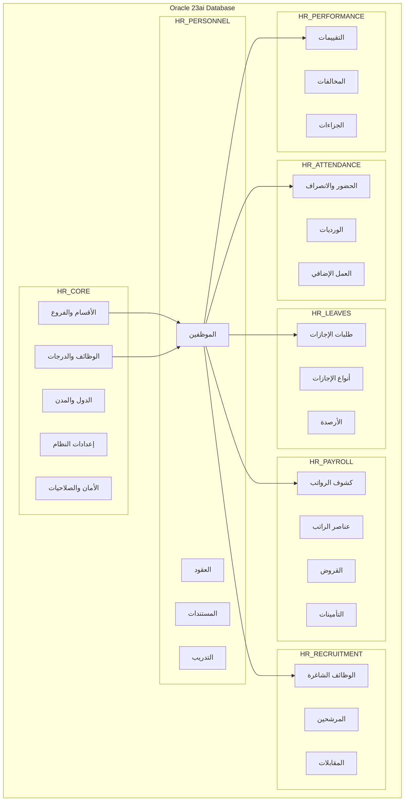

---

## 3. تفصيل الوحدات (Schemas)

---

### 3.1 HR_CORE - النواة الأساسية

> **الوصف:** يحتوي على البيانات المرجعية والإعدادات الأساسية التي تعتمد عليها جميع الوحدات الأخرى.

#### الجداول (18 جدول):

| # | الجدول | الوصف | الحقول الرئيسية |
|:---:|:---|:---|:---|
| 1 | COUNTRIES | الدول | COUNTRY_ID, COUNTRY_NAME_AR, ISO_CODE |
| 2 | CITIES | المدن | CITY_ID, COUNTRY_ID, CITY_NAME_AR |
| 3 | BRANCHES | الفروع | BRANCH_ID, BRANCH_NAME_AR, CITY_ID |
| 4 | DEPARTMENTS | الأقسام | DEPT_ID, DEPT_NAME_AR, BRANCH_ID |
| 5 | JOB_GRADES | الدرجات الوظيفية | GRADE_ID, GRADE_NAME, MIN_SALARY, MAX_SALARY |
| 6 | JOBS | الوظائف | JOB_ID, JOB_TITLE_AR, DEFAULT_GRADE_ID |
| 7 | DOCUMENT_TYPES | أنواع المستندات | DOC_TYPE_ID, DOC_NAME_AR, IS_MANDATORY |
| 8 | BANKS | البنوك | BANK_ID, BANK_NAME_AR, BANK_CODE |
| 9 | SYSTEM_SETTINGS | إعدادات النظام | SETTING_KEY, SETTING_VALUE |
| 10 | AUDIT_LOGS | سجل التدقيق | LOG_ID, TABLE_NAME, ACTION, USER_ID |
| 11 | NOTIFICATIONS | الإشعارات | NOTIFICATION_ID, USER_ID, MESSAGE |
| 12 | WORKFLOW_APPROVALS | الموافقات | APPROVAL_ID, REQUEST_TYPE, STATUS |
| 13 | REPORT_TEMPLATES | قوالب التقارير | TEMPLATE_ID, REPORT_NAME |
| 14 | SYSTEM_USERS | مستخدمي النظام | USER_ID, USERNAME, PASSWORD_HASH |
| 15 | SYSTEM_ROLES | الأدوار | ROLE_ID, ROLE_NAME |
| 16 | SYSTEM_PERMISSIONS | الصلاحيات | PERMISSION_ID, PERMISSION_NAME |
| 17 | USER_ROLES | ربط المستخدمين بالأدوار | USER_ID, ROLE_ID |
| 18 | ROLE_PERMISSIONS | ربط الأدوار بالصلاحيات | ROLE_ID, PERMISSION_ID |

#### مخطط العلاقات:

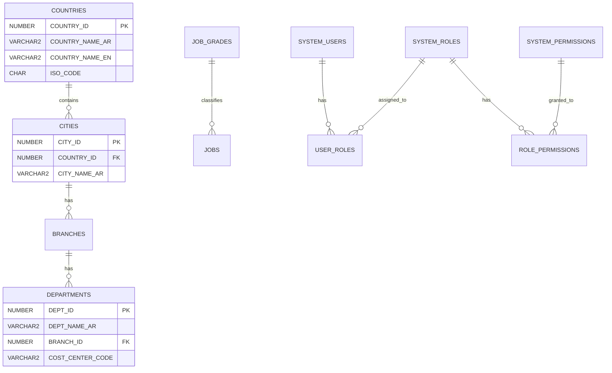

---

### 3.2 HR_PERSONNEL - شؤون الموظفين

> **الوصف:** يدير جميع بيانات الموظفين من التعيين حتى إنهاء الخدمة.

#### الجداول (15 جدول):

| # | الجدول | الوصف |
|:---:|:---|:---|
| 1 | EMPLOYEES | بيانات الموظفين الأساسية |
| 2 | EMPLOYEE_DOCUMENTS | مستندات الموظفين |
| 3 | EMPLOYEE_QUALIFICATIONS | المؤهلات العلمية |
| 4 | EMPLOYEE_EXPERIENCES | الخبرات السابقة |
| 5 | EMPLOYEE_CERTIFICATIONS | الشهادات المهنية |
| 6 | EMPLOYEE_ADDRESSES | العناوين |
| 7 | EMERGENCY_CONTACTS | جهات الاتصال الطارئة |
| 8 | EMPLOYEE_BANK_ACCOUNTS | الحسابات البنكية |
| 9 | CONTRACTS | العقود |
| 10 | CONTRACT_RENEWALS | تجديدات العقود |
| 11 | DEPENDENTS | المعالين |
| 12 | TRAINING_COURSES | الدورات التدريبية |
| 13 | EMPLOYEE_TRAINING | تدريب الموظفين |
| 14 | EMPLOYEE_ASSETS | أصول الموظفين |
| 15 | EMPLOYEE_TRANSFERS | نقل الموظفين |

#### مخطط العلاقات:

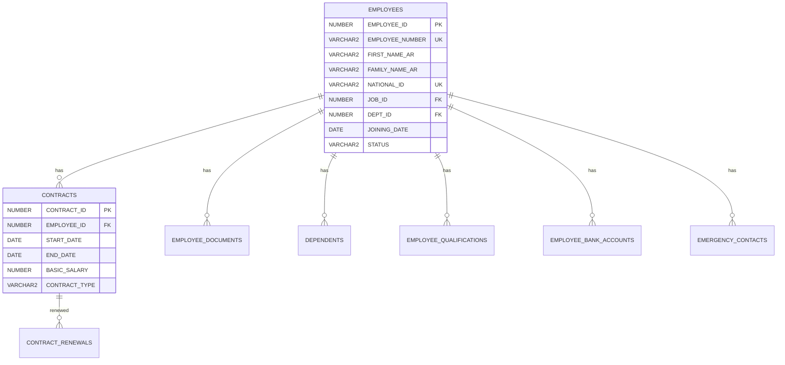

---

### 3.3 HR_ATTENDANCE - الحضور والانصراف

> **الوصف:** يدير تسجيل الحضور، الورديات، والعمل الإضافي.

#### الجداول (8 جداول):

| # | الجدول | الوصف |
|:---:|:---|:---|
| 1 | SHIFT_TYPES | أنواع الورديات |
| 2 | ROSTER_PERIODS | فترات الجداول |
| 3 | EMPLOYEE_ROSTERS | جداول الموظفين |
| 4 | RAW_PUNCH_LOGS | سجلات البصمة الخام |
| 5 | DAILY_ATTENDANCE | الحضور اليومي |
| 6 | SHIFT_SWAP_REQUESTS | طلبات تبديل الورديات |
| 7 | OVERTIME_REQUESTS | طلبات العمل الإضافي |
| 8 | ATTENDANCE_POLICIES | سياسات الحضور |

#### تدفق العمل:

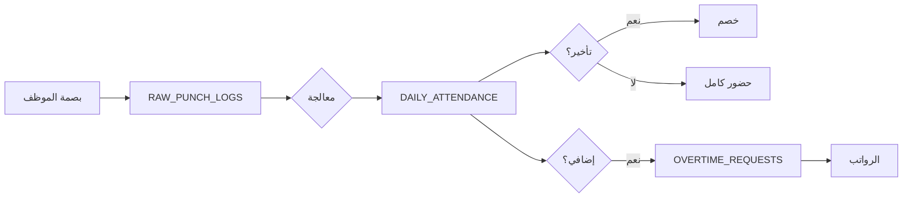

---

### 3.4 HR_LEAVES - الإجازات

> **الوصف:** يدير أنواع الإجازات، الأرصدة، والطلبات.

#### الجداول (7 جداول):

| # | الجدول | الوصف |
|:---:|:---|:---|
| 1 | LEAVE_TYPES | أنواع الإجازات |
| 2 | EMPLOYEE_LEAVE_BALANCES | أرصدة الإجازات |
| 3 | LEAVE_REQUESTS | طلبات الإجازات |
| 4 | PUBLIC_HOLIDAYS | الإجازات الرسمية |
| 5 | LEAVE_ACCRUAL_RULES | قواعد الاستحقاق |
| 6 | LEAVE_ENCASHMENT | صرف رصيد الإجازات |
| 7 | LEAVE_TRANSACTIONS | حركات الإجازات |

#### دورة حياة طلب الإجازة:

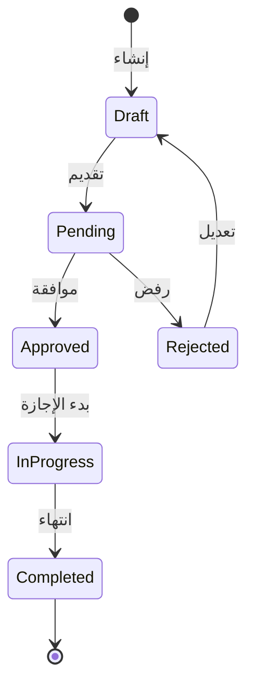

---

### 3.5 HR_PAYROLL - الرواتب والأجور

> **الوصف:** يدير حساب الرواتب، الاستقطاعات، والمزايا.

#### الجداول (13 جدول):

| # | الجدول | الوصف |
|:---:|:---|:---|
| 1 | SALARY_ELEMENTS | عناصر الراتب |
| 2 | EMPLOYEE_SALARY_STRUCTURE | هيكل راتب الموظف |
| 3 | LOANS | القروض |
| 4 | LOAN_INSTALLMENTS | أقساط القروض |
| 5 | PAYROLL_RUNS | دورات الرواتب |
| 6 | PAYSLIPS | كشوف الرواتب |
| 7 | PAYSLIP_DETAILS | تفاصيل كشف الراتب |
| 8 | END_OF_SERVICE_CALC | حساب نهاية الخدمة |
| 9 | PAYROLL_ADJUSTMENTS | تسويات الرواتب |
| 10 | INSURANCE_PLANS | خطط التأمين |
| 11 | EMPLOYEE_INSURANCE | تأمين الموظفين |
| 12 | BONUSES | المكافآت |

#### تدفق حساب الراتب:

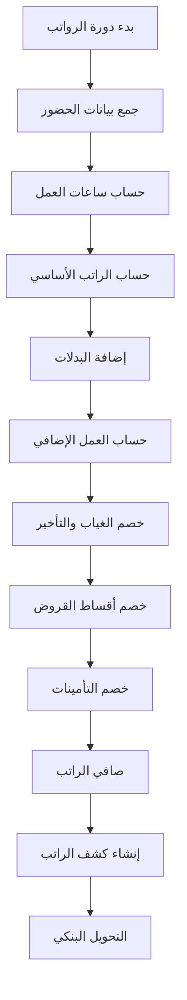

---

### 3.6 HR_RECRUITMENT - التوظيف

> **الوصف:** يدير عملية التوظيف من الإعلان حتى التعيين.

#### الجداول (5 جداول):

| # | الجدول | الوصف |
|:---:|:---|:---|
| 1 | JOB_VACANCIES | الوظائف الشاغرة |
| 2 | CANDIDATES | المرشحين |
| 3 | APPLICATIONS | طلبات التقديم |
| 4 | INTERVIEWS | المقابلات |
| 5 | OFFERS | عروض العمل |

#### مراحل التوظيف:

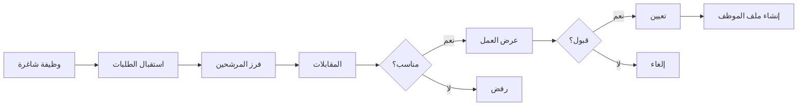

---

### 3.7 HR_PERFORMANCE - الأداء

> **الوصف:** يدير تقييم أداء الموظفين والجزاءات.

#### الجداول (7 جداول):

| # | الجدول | الوصف |
|:---:|:---|:---|
| 1 | KPI_LIBRARIES | مكتبة مؤشرات الأداء |
| 2 | APPRAISAL_CYCLES | دورات التقييم |
| 3 | EMPLOYEE_APPRAISALS | تقييمات الموظفين |
| 4 | APPRAISAL_DETAILS | تفاصيل التقييم |
| 5 | VIOLATION_TYPES | أنواع المخالفات |
| 6 | DISCIPLINARY_ACTIONS | الإجراءات التأديبية |
| 7 | EMPLOYEE_VIOLATIONS | مخالفات الموظفين |

---

## 4. العلاقات بين الوحدات

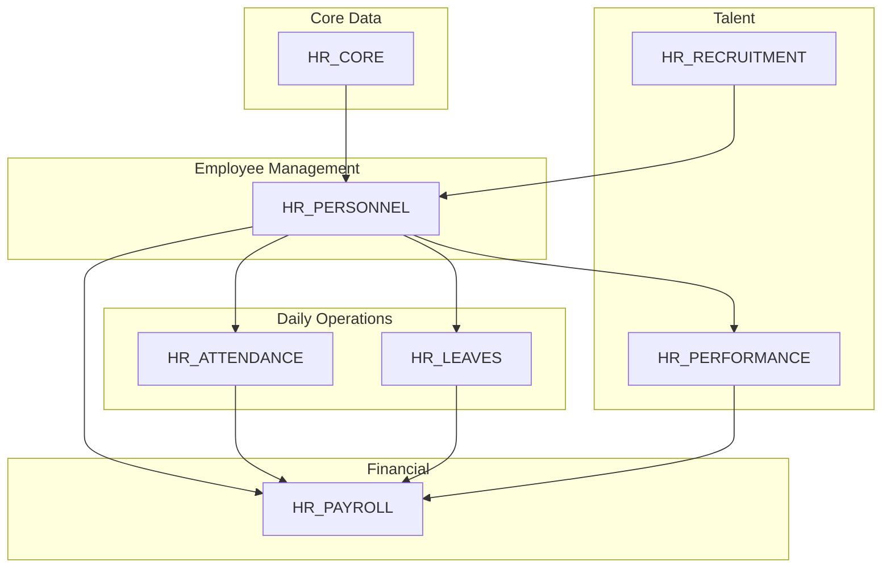

---

## 5. PL/SQL Packages

### 5.1 الـ Packages المتوفرة:

| Package | Schema | الوظيفة الرئيسية |
|:---|:---|:---|
| PKG_EMP_MANAGER | HR_PERSONNEL | إدارة الموظفين والعقود |
| PKG_LEAVE_MANAGER | HR_LEAVES | إدارة الإجازات والأرصدة |
| PKG_PAYROLL_MANAGER | HR_PAYROLL | حساب وتشغيل الرواتب |
| PKG_ATTENDANCE_MANAGER | HR_ATTENDANCE | إدارة الحضور والورديات |
| PKG_PERFORMANCE_MANAGER | HR_PERFORMANCE | إدارة التقييمات والجزاءات |
| PKG_SECURITY_MANAGER | HR_CORE | إدارة الأمان والصلاحيات |

### 5.2 الوظائف الرئيسية:

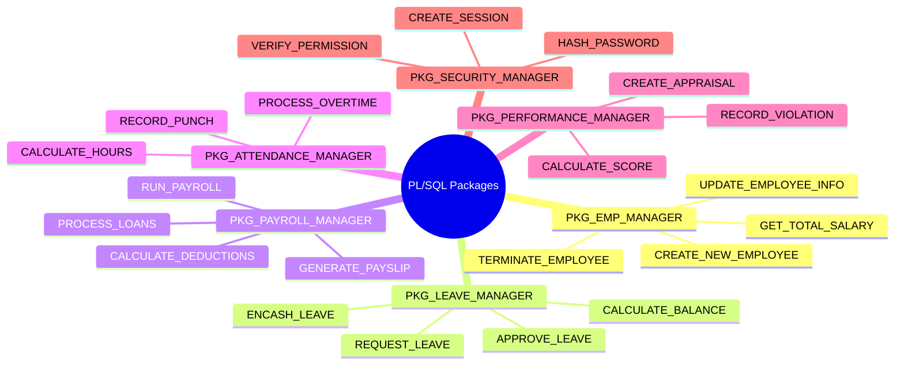

---

## 6. APEX Workspaces

| Workspace | Schema | المستخدم | الوظيفة |
|:---|:---|:---|:---|
| HR_CORE | HR_CORE | ADMIN | إدارة النظام |
| HR_PERSONNEL | HR_PERSONNEL | HR_MANAGER | شؤون الموظفين |
| HR_ATTENDANCE | HR_ATTENDANCE | ATTENDANCE_ADMIN | الحضور |
| HR_LEAVES | HR_LEAVES | LEAVE_ADMIN | الإجازات |
| HR_PAYROLL | HR_PAYROLL | PAYROLL_ADMIN | الرواتب |
| HR_RECRUITMENT | HR_RECRUITMENT | RECRUIT_ADMIN | التوظيف |
| HR_PERFORMANCE | HR_PERFORMANCE | PERF_ADMIN | الأداء |
| HR_SYSTEM_ADMIN | HR_System_Admin | SYSTEM_ADMIN | إدارة عامة |
| HR_SYSTEM_PDB | HR_System_PDB | PDB_ADMIN | قاعدة البيانات |

---

## 7. تدفق العمليات الرئيسية

### 7.1 دورة حياة الموظف:

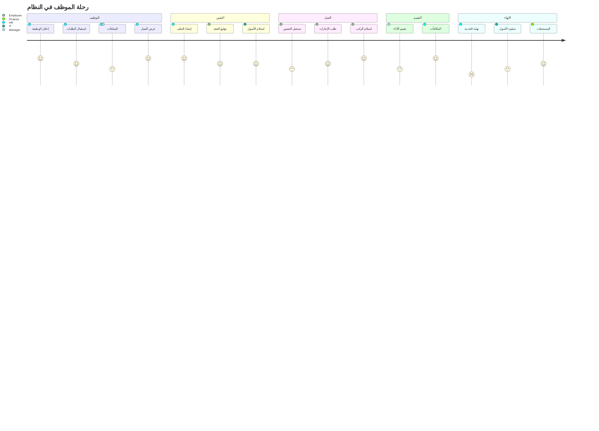

### 7.2 دورة الرواتب الشهرية:

```mermaid
gantt
    title دورة الرواتب الشهرية
    dateFormat  DD
    section التحضير
    جمع بيانات الحضور     :a1, 01, 3d
    مراجعة الإجازات       :a2, after a1, 2d
    section الحساب
    حساب الرواتب         :b1, after a2, 2d
    مراجعة الخصومات      :b2, after b1, 1d
    section الاعتماد
    اعتماد المدير        :c1, after b2, 1d
    اعتماد المالية       :c2, after c1, 1d
    section الصرف
    التحويل البنكي       :d1, after c2, 1d
    إرسال الكشوف         :d2, after d1, 1d
```

---

## 8. الأمان والصلاحيات

### 8.1 نموذج الصلاحيات:

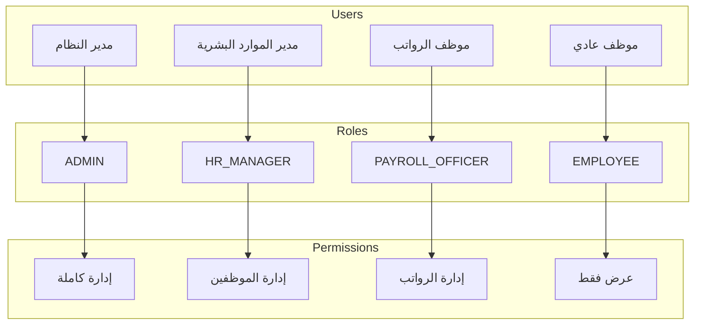

### 8.2 مصفوفة الصلاحيات:

| الـ Schema | ADMIN | HR_MANAGER | PAYROLL | EMPLOYEE |
|:---|:---:|:---:|:---:|:---:|
| HR_CORE | كامل | قراءة | قراءة | - |
| HR_PERSONNEL | كامل | كامل | قراءة | ذاتي |
| HR_ATTENDANCE | كامل | قراءة/كتابة | قراءة | ذاتي |
| HR_LEAVES | كامل | قراءة/كتابة | قراءة | ذاتي |
| HR_PAYROLL | كامل | قراءة | كامل | ذاتي |
| HR_PERFORMANCE | كامل | كامل | قراءة | ذاتي |
| HR_RECRUITMENT | كامل | كامل | - | - |

---

## 9. التقارير والإحصائيات

### 9.1 التقارير المتوفرة:

| التقرير | الوصف | التكرار |
|:---|:---|:---|
| تقرير الموظفين | قائمة جميع الموظفين | عند الطلب |
| تقرير الحضور | ملخص الحضور الشهري | شهري |
| تقرير الإجازات | أرصدة ومستخدم الإجازات | شهري |
| كشوف الرواتب | رواتب جميع الموظفين | شهري |
| تقرير التقييم | نتائج تقييم الأداء | سنوي |
| تقرير التوظيف | حالة الوظائف الشاغرة | أسبوعي |

---

## 10. الخلاصة

### ✅ نقاط القوة:
- بنية modular واضحة (10 schemas)
- تغطية شاملة لعمليات HR
- PL/SQL Packages جاهزة للاستخدام
- تكامل مع Oracle APEX

### 🚀 التوسعات المستقبلية:
- JSON Duality Views للـ REST APIs
- Mobile App Integration
- AI-powered Analytics
- Employee Self-Service Portal

---

**تم إعداد هذا التحليل بتاريخ:** 2026-01-17  
**النظام:** Oracle 23ai Free Developer  
**المنفذ:** 1522 | **الـ PDB:** FREEPDB1
