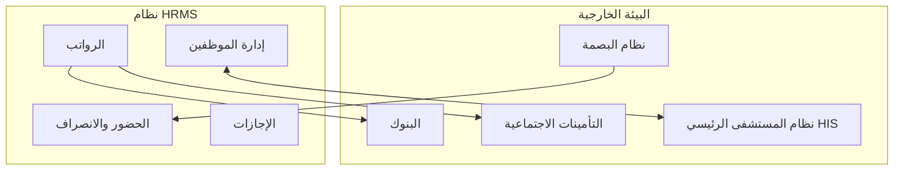
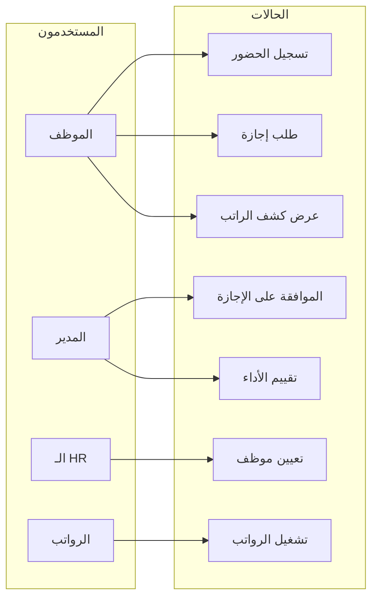
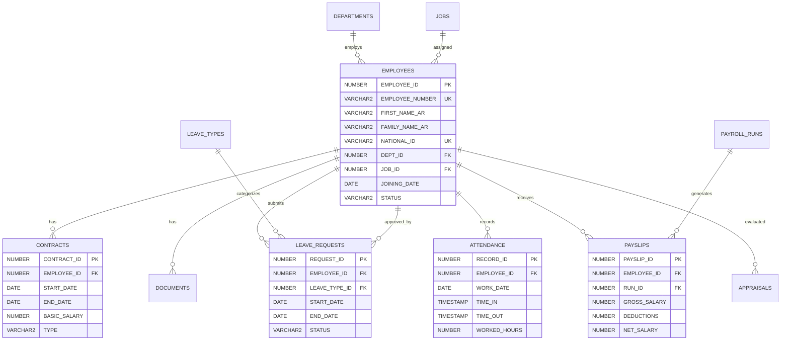
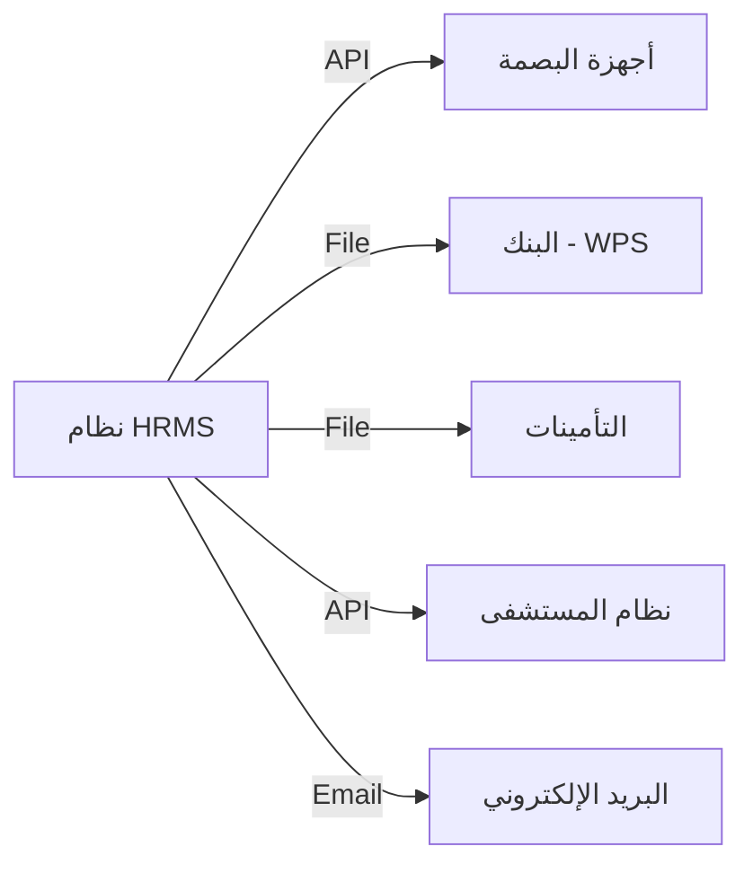
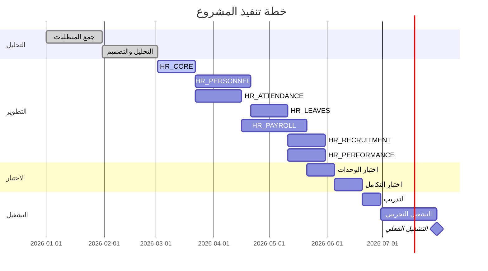

# وثيقة متطلبات البرمجيات (SRS)
# نظام إدارة الموارد البشرية للمستشفى
## Hospital Human Resources Management System

---

**رقم الوثيقة:** HRMS-SRS-2026-001  
**الإصدار:** 1.0  
**التاريخ:** 2026-01-17  
**الحالة:** نهائي للمناقشة

---

## جدول المحتويات

1. [المقدمة](#1-المقدمة)
2. [الوصف العام للنظام](#2-الوصف-العام-للنظام)
3. [المتطلبات الوظيفية](#3-المتطلبات-الوظيفية)
4. [المتطلبات غير الوظيفية](#4-المتطلبات-غير-الوظيفية)
5. [نماذج حالات الاستخدام](#5-نماذج-حالات-الاستخدام)
6. [نموذج البيانات](#6-نموذج-البيانات)
7. [واجهات النظام](#7-واجهات-النظام)
8. [الأمان والصلاحيات](#8-الأمان-والصلاحيات)
9. [الملاحق](#9-الملاحق)

---

# 1. المقدمة

## 1.1 الغرض من الوثيقة

تهدف هذه الوثيقة إلى تحديد المتطلبات الوظيفية وغير الوظيفية لنظام إدارة الموارد البشرية للمستشفى بشكل شامل ومفصل، لتكون مرجعاً أساسياً لفريق التطوير وأصحاب المصلحة.

## 1.2 نطاق النظام

نظام متكامل لإدارة جميع عمليات الموارد البشرية في بيئة المستشفى، يشمل:

- إدارة بيانات الموظفين (أطباء، ممرضين، إداريين، فنيين)
- إدارة الحضور والانصراف والورديات
- إدارة الإجازات والأرصدة
- إدارة الرواتب والمستحقات
- إدارة التوظيف والتعيين
- إدارة الأداء والتقييم
- إدارة التدريب والتطوير
- إدارة المخالفات والجزاءات

## 1.3 المصطلحات والاختصارات

| المصطلح | التعريف |
|:---|:---|
| HRMS | نظام إدارة الموارد البشرية |
| SRS | وثيقة متطلبات البرمجيات |
| EOS | نهاية الخدمة |
| KPI | مؤشرات الأداء الرئيسية |
| GOSI | التأمينات الاجتماعية |
| WPS | نظام حماية الأجور |

## 1.4 المراجع

- نظام العمل السعودي
- لوائح وزارة الصحة
- معايير JCI للاعتماد الصحي
- سياسات المستشفى الداخلية

---

# 2. الوصف العام للنظام

## 2.1 منظور النظام

## 2.2 فئات المستخدمين

| الفئة | الوصف | عدد تقديري |
|:---|:---|:---:|
| مدير النظام | إدارة كاملة للنظام والصلاحيات | 2 |
| مدير الموارد البشرية | إدارة شؤون الموظفين | 5 |
| مسؤول الرواتب | إدارة الرواتب والمستحقات | 3 |
| مدير القسم | الموافقة على الطلبات | 50 |
| الموظف | الخدمة الذاتية | 2000 |

## 2.3 خصائص المستشفى

| البند | التفاصيل |
|:---|:---|
| عدد الأسرة | 500+ سرير |
| عدد الموظفين | 2000+ موظف |
| الأقسام | 30+ قسم |
| الفروع | 3 مباني |
| نظام العمل | 24/7 (ورديات) |

## 2.4 القيود والافتراضات

### القيود:
- التوافق مع نظام العمل السعودي
- التكامل مع نظام التأمينات الاجتماعية
- دعم اللغة العربية والإنجليزية
- التوافق مع أجهزة البصمة الموجودة

### الافتراضات:
- توفر بنية تحتية شبكية مستقرة
- وجود نظام بريد إلكتروني للإشعارات
- توفر أجهزة بصمة متوافقة

---

# 3. المتطلبات الوظيفية

## 3.1 وحدة البيانات الأساسية (HR_CORE)

### 3.1.1 إدارة الهيكل التنظيمي

| الرقم | المتطلب | الأولوية |
|:---:|:---|:---:|
| REQ-CORE-001 | تعريف الفروع والمباني | عالية |
| REQ-CORE-002 | تعريف الأقسام والوحدات | عالية |
| REQ-CORE-003 | ربط الأقسام بالفروع | عالية |
| REQ-CORE-004 | تحديد مراكز التكلفة | متوسطة |
| REQ-CORE-005 | تعريف التسلسل الإداري | عالية |

### 3.1.2 إدارة الوظائف

| الرقم | المتطلب | الأولوية |
|:---:|:---|:---:|
| REQ-CORE-006 | تعريف المسميات الوظيفية | عالية |
| REQ-CORE-007 | تصنيف الوظائف (طبية/إدارية/فنية) | عالية |
| REQ-CORE-008 | تحديد الدرجات الوظيفية | عالية |
| REQ-CORE-009 | ربط سلم الرواتب بالدرجات | عالية |
| REQ-CORE-010 | تحديد المتطلبات لكل وظيفة | متوسطة |

### 3.1.3 البيانات المرجعية

| الرقم | المتطلب | الأولوية |
|:---:|:---|:---:|
| REQ-CORE-011 | قائمة الدول والجنسيات | عالية |
| REQ-CORE-012 | قائمة المدن | عالية |
| REQ-CORE-013 | قائمة البنوك | عالية |
| REQ-CORE-014 | أنواع المستندات المطلوبة | عالية |
| REQ-CORE-015 | إعدادات النظام العامة | عالية |

---

## 3.2 وحدة شؤون الموظفين (HR_PERSONNEL)

### 3.2.1 إدارة بيانات الموظف

| الرقم | المتطلب | الأولوية |
|:---:|:---|:---:|
| REQ-PER-001 | تسجيل بيانات الموظف الأساسية | عالية |
| REQ-PER-002 | إنشاء رقم وظيفي فريد تلقائياً | عالية |
| REQ-PER-003 | تحميل صورة الموظف | متوسطة |
| REQ-PER-004 | تسجيل بيانات الهوية (وطنية/إقامة) | عالية |
| REQ-PER-005 | تسجيل بيانات جواز السفر | عالية |
| REQ-PER-006 | تسجيل العناوين (محلي/دولي) | متوسطة |
| REQ-PER-007 | تسجيل بيانات الاتصال | عالية |
| REQ-PER-008 | تسجيل الحالة الاجتماعية | عالية |
| REQ-PER-009 | تسجيل بيانات المعالين | عالية |
| REQ-PER-010 | تسجيل جهات الاتصال الطارئة | عالية |

### 3.2.2 إدارة المؤهلات

| الرقم | المتطلب | الأولوية |
|:---:|:---|:---:|
| REQ-PER-011 | تسجيل المؤهلات العلمية | عالية |
| REQ-PER-012 | تسجيل الشهادات المهنية | عالية |
| REQ-PER-013 | تسجيل الخبرات السابقة | متوسطة |
| REQ-PER-014 | تسجيل الدورات التدريبية | متوسطة |
| REQ-PER-015 | تسجيل اللغات | منخفضة |

### 3.2.3 إدارة المستندات

| الرقم | المتطلب | الأولوية |
|:---:|:---|:---:|
| REQ-PER-016 | تحميل المستندات المطلوبة | عالية |
| REQ-PER-017 | تتبع تواريخ انتهاء المستندات | عالية |
| REQ-PER-018 | إرسال تنبيهات قبل الانتهاء | عالية |
| REQ-PER-019 | أرشفة المستندات المنتهية | متوسطة |

### 3.2.4 إدارة العقود

| الرقم | المتطلب | الأولوية |
|:---:|:---|:---:|
| REQ-PER-020 | إنشاء عقد العمل | عالية |
| REQ-PER-021 | تحديد نوع العقد (محدد/غير محدد) | عالية |
| REQ-PER-022 | تحديد الراتب والبدلات | عالية |
| REQ-PER-023 | تجديد العقود | عالية |
| REQ-PER-024 | إنهاء العقود | عالية |
| REQ-PER-025 | تتبع فترة التجربة | عالية |

### 3.2.5 إدارة الحسابات البنكية

| الرقم | المتطلب | الأولوية |
|:---:|:---|:---:|
| REQ-PER-026 | تسجيل الحساب البنكي | عالية |
| REQ-PER-027 | تحديد رقم الآيبان | عالية |
| REQ-PER-028 | دعم حسابات متعددة | منخفضة |

---

## 3.3 وحدة الحضور والانصراف (HR_ATTENDANCE)

### 3.3.1 إدارة الورديات

| الرقم | المتطلب | الأولوية |
|:---:|:---|:---:|
| REQ-ATT-001 | تعريف أنواع الورديات | عالية |
| REQ-ATT-002 | تحديد أوقات الوردية | عالية |
| REQ-ATT-003 | تحديد فترة السماح | عالية |
| REQ-ATT-004 | إنشاء جداول الورديات | عالية |
| REQ-ATT-005 | تعيين الموظفين للورديات | عالية |

### 3.3.2 تسجيل الحضور

| الرقم | المتطلب | الأولوية |
|:---:|:---|:---:|
| REQ-ATT-006 | استقبال بيانات البصمة | عالية |
| REQ-ATT-007 | معالجة بيانات الحضور | عالية |
| REQ-ATT-008 | حساب ساعات العمل | عالية |
| REQ-ATT-009 | تحديد التأخير والخروج المبكر | عالية |
| REQ-ATT-010 | تسجيل الغياب | عالية |

### 3.3.3 العمل الإضافي

| الرقم | المتطلب | الأولوية |
|:---:|:---|:---:|
| REQ-ATT-011 | طلب عمل إضافي | عالية |
| REQ-ATT-012 | الموافقة على العمل الإضافي | عالية |
| REQ-ATT-013 | حساب ساعات العمل الإضافي | عالية |
| REQ-ATT-014 | ربط العمل الإضافي بالرواتب | عالية |

### 3.3.4 طلبات خاصة

| الرقم | المتطلب | الأولوية |
|:---:|:---|:---:|
| REQ-ATT-015 | طلب تبديل وردية | متوسطة |
| REQ-ATT-016 | طلب إذن خروج | متوسطة |
| REQ-ATT-017 | تبرير غياب | عالية |

---

## 3.4 وحدة الإجازات (HR_LEAVES)

### 3.4.1 إدارة أنواع الإجازات

| الرقم | المتطلب | الأولوية |
|:---:|:---|:---:|
| REQ-LEV-001 | تعريف أنواع الإجازات | عالية |
| REQ-LEV-002 | تحديد الاستحقاق السنوي | عالية |
| REQ-LEV-003 | تحديد قواعد الترحيل | عالية |
| REQ-LEV-004 | تحديد الحد الأقصى للتراكم | عالية |

### أنواع الإجازات المطلوبة:

| النوع | الاستحقاق | مدفوعة | قابلة للترحيل |
|:---|:---:|:---:|:---:|
| سنوية | 30 يوم | نعم | نعم |
| مرضية | 120 يوم | جزئي | لا |
| أمومة | 70 يوم | نعم | لا |
| أبوة | 3 أيام | نعم | لا |
| زواج | 5 أيام | نعم | لا |
| وفاة قريب | 5 أيام | نعم | لا |
| الحج | 15 يوم | نعم | لا |
| بدون راتب | - | لا | لا |
| تعليمية | - | جزئي | لا |

### 3.4.2 إدارة طلبات الإجازات

| الرقم | المتطلب | الأولوية |
|:---:|:---|:---:|
| REQ-LEV-005 | تقديم طلب إجازة | عالية |
| REQ-LEV-006 | التحقق من الرصيد | عالية |
| REQ-LEV-007 | مسار الموافقات | عالية |
| REQ-LEV-008 | إشعار بالموافقة/الرفض | عالية |
| REQ-LEV-009 | إلغاء/تعديل الطلب | متوسطة |
| REQ-LEV-010 | قطع الإجازة | متوسطة |

### 3.4.3 إدارة الأرصدة

| الرقم | المتطلب | الأولوية |
|:---:|:---|:---:|
| REQ-LEV-011 | حساب الرصيد الافتتاحي | عالية |
| REQ-LEV-012 | الاستحقاق الشهري | عالية |
| REQ-LEV-013 | خصم المستخدم | عالية |
| REQ-LEV-014 | ترحيل الرصيد | عالية |
| REQ-LEV-015 | صرف بدل الإجازة | عالية |

---

## 3.5 وحدة الرواتب (HR_PAYROLL)

### 3.5.1 هيكل الراتب

| الرقم | المتطلب | الأولوية |
|:---:|:---|:---:|
| REQ-PAY-001 | تعريف عناصر الراتب | عالية |
| REQ-PAY-002 | تحديد نوع العنصر (إضافة/خصم) | عالية |
| REQ-PAY-003 | تحديد طريقة الحساب | عالية |
| REQ-PAY-004 | ربط العناصر بالموظف | عالية |

### عناصر الراتب:

| العنصر | النوع | طريقة الحساب |
|:---|:---:|:---|
| الراتب الأساسي | إضافة | ثابت |
| بدل السكن | إضافة | نسبة 25% |
| بدل النقل | إضافة | ثابت 1000 |
| بدل الطبيعة الطبية | إضافة | نسبة 20% |
| بدل المناوبة | إضافة | حسب الأيام |
| العمل الإضافي | إضافة | ساعات × معدل |
| خصم التأخير | خصم | ساعات × معدل |
| خصم الغياب | خصم | أيام × يومي |
| التأمينات (الموظف) | خصم | نسبة 9.75% |
| قسط القرض | خصم | ثابت |

### 3.5.2 القروض والسلف

| الرقم | المتطلب | الأولوية |
|:---:|:---|:---:|
| REQ-PAY-005 | طلب قرض/سلفة | عالية |
| REQ-PAY-006 | تحديد مبلغ وعدد الأقساط | عالية |
| REQ-PAY-007 | الموافقة على القرض | عالية |
| REQ-PAY-008 | خصم القسط الشهري | عالية |
| REQ-PAY-009 | تسوية القرض المبكرة | متوسطة |

### 3.5.3 تشغيل الرواتب

| الرقم | المتطلب | الأولوية |
|:---:|:---|:---:|
| REQ-PAY-010 | تجميع بيانات الحضور | عالية |
| REQ-PAY-011 | حساب الاستحقاقات | عالية |
| REQ-PAY-012 | حساب الخصومات | عالية |
| REQ-PAY-013 | حساب صافي الراتب | عالية |
| REQ-PAY-014 | مراجعة واعتماد | عالية |
| REQ-PAY-015 | إنشاء ملف البنك (WPS) | عالية |
| REQ-PAY-016 | إنشاء كشوف الرواتب | عالية |

### 3.5.4 التأمينات الاجتماعية

| الرقم | المتطلب | الأولوية |
|:---:|:---|:---:|
| REQ-PAY-017 | حساب حصة الموظف (9.75%) | عالية |
| REQ-PAY-018 | حساب حصة المنشأة (11.75%) | عالية |
| REQ-PAY-019 | إنشاء ملف GOSI | عالية |

### 3.5.5 نهاية الخدمة

| الرقم | المتطلب | الأولوية |
|:---:|:---|:---:|
| REQ-PAY-020 | حساب مكافأة نهاية الخدمة | عالية |
| REQ-PAY-021 | حساب رصيد الإجازات | عالية |
| REQ-PAY-022 | حساب المستحقات النهائية | عالية |
| REQ-PAY-023 | إنشاء إخلاء الطرف | عالية |

---

## 3.6 وحدة التوظيف (HR_RECRUITMENT)

### 3.6.1 إدارة الوظائف الشاغرة

| الرقم | المتطلب | الأولوية |
|:---:|:---|:---:|
| REQ-REC-001 | إنشاء طلب توظيف | عالية |
| REQ-REC-002 | الموافقة على الطلب | عالية |
| REQ-REC-003 | نشر الإعلان | عالية |
| REQ-REC-004 | تحديد متطلبات الوظيفة | عالية |

### 3.6.2 إدارة المرشحين

| الرقم | المتطلب | الأولوية |
|:---:|:---|:---:|
| REQ-REC-005 | استقبال الطلبات | عالية |
| REQ-REC-006 | تحميل السيرة الذاتية | عالية |
| REQ-REC-007 | تصنيف المرشحين | عالية |
| REQ-REC-008 | فرز المرشحين المؤهلين | عالية |

### 3.6.3 المقابلات

| الرقم | المتطلب | الأولوية |
|:---:|:---|:---:|
| REQ-REC-009 | جدولة المقابلات | عالية |
| REQ-REC-010 | تسجيل نتائج المقابلة | عالية |
| REQ-REC-011 | تقييم المرشح | عالية |

### 3.6.4 عروض العمل

| الرقم | المتطلب | الأولوية |
|:---:|:---|:---:|
| REQ-REC-012 | إنشاء عرض عمل | عالية |
| REQ-REC-013 | إرسال العرض للمرشح | عالية |
| REQ-REC-014 | تتبع حالة العرض | عالية |
| REQ-REC-015 | تحويل المرشح لموظف | عالية |

---

## 3.7 وحدة الأداء (HR_PERFORMANCE)

### 3.7.1 إدارة التقييمات

| الرقم | المتطلب | الأولوية |
|:---:|:---|:---:|
| REQ-PRF-001 | تعريف دورات التقييم | عالية |
| REQ-PRF-002 | تعريف معايير التقييم (KPIs) | عالية |
| REQ-PRF-003 | إنشاء نموذج التقييم | عالية |
| REQ-PRF-004 | تقييم الموظف | عالية |
| REQ-PRF-005 | مراجعة واعتماد التقييم | عالية |

### معايير التقييم:

| المعيار | الوزن | المقياس |
|:---|:---:|:---|
| جودة العمل | 25% | 1-5 |
| الالتزام | 20% | 1-5 |
| العمل الجماعي | 15% | 1-5 |
| المبادرة | 15% | 1-5 |
| المهارات التقنية | 25% | 1-5 |

### 3.7.2 إدارة المخالفات والجزاءات

| الرقم | المتطلب | الأولوية |
|:---:|:---|:---:|
| REQ-PRF-006 | تعريف أنواع المخالفات | عالية |
| REQ-PRF-007 | تسجيل مخالفة | عالية |
| REQ-PRF-008 | تحديد الجزاء | عالية |
| REQ-PRF-009 | التدرج في الجزاءات | عالية |
| REQ-PRF-010 | ربط الجزاءات بالرواتب | عالية |

### سلم الجزاءات:

| التكرار | الجزاء |
|:---:|:---|
| الأولى | إنذار شفهي |
| الثانية | إنذار كتابي |
| الثالثة | خصم يوم |
| الرابعة | خصم يومين |
| الخامسة+ | حسب النظام |

---

## 3.8 وحدة التدريب (HR_TRAINING)

### 3.8.1 إدارة الدورات

| الرقم | المتطلب | الأولوية |
|:---:|:---|:---:|
| REQ-TRN-001 | تسجيل الدورات المتاحة | متوسطة |
| REQ-TRN-002 | تحديد الدورات الإلزامية | عالية |
| REQ-TRN-003 | ترشيح الموظفين | متوسطة |
| REQ-TRN-004 | تسجيل نتائج التدريب | متوسطة |

---

# 4. المتطلبات غير الوظيفية

## 4.1 الأداء

| الرقم | المتطلب | المعيار |
|:---:|:---|:---|
| NFR-001 | زمن استجابة الصفحة | أقل من 3 ثواني |
| NFR-002 | تشغيل الرواتب (2000 موظف) | أقل من 10 دقائق |
| NFR-003 | عدد المستخدمين المتزامنين | 500 مستخدم |
| NFR-004 | حجم التخزين السنوي | 50 GB |

## 4.2 الأمان

| الرقم | المتطلب |
|:---:|:---|
| NFR-005 | تشفير كلمات المرور (SHA-256) |
| NFR-006 | تشفير الاتصال (HTTPS/TLS) |
| NFR-007 | سجل تدقيق لجميع العمليات |
| NFR-008 | قفل الحساب بعد 5 محاولات فاشلة |
| NFR-009 | انتهاء الجلسة بعد 30 دقيقة |

## 4.3 التوافرية

| الرقم | المتطلب | المعيار |
|:---:|:---|:---|
| NFR-010 | نسبة التوافر | 99.5% |
| NFR-011 | النسخ الاحتياطي | يومي |
| NFR-012 | استعادة البيانات | خلال 4 ساعات |

## 4.4 قابلية الاستخدام

| الرقم | المتطلب |
|:---:|:---|
| NFR-013 | دعم اللغة العربية والإنجليزية |
| NFR-014 | تصميم متجاوب (Responsive) |
| NFR-015 | توافق مع المتصفحات الحديثة |

---

# 5. نماذج حالات الاستخدام

## 5.1 مخطط حالات الاستخدام العام

## 5.2 حالة استخدام: طلب إجازة

**الفاعل:** الموظف  
**الهدف:** تقديم طلب إجازة والحصول على الموافقة

**المسار الرئيسي:**
1. يفتح الموظف شاشة طلب الإجازة
2. يختار نوع الإجازة
3. يحدد تاريخ البداية والنهاية
4. النظام يتحقق من الرصيد المتاح
5. النظام يتحقق من عدم التعارض
6. يقدم الموظف الطلب
7. يرسل النظام إشعار للمدير
8. المدير يوافق/يرفض
9. يرسل النظام إشعار للموظف

**المسارات البديلة:**
- 4أ: الرصيد غير كافٍ → رسالة خطأ
- 5أ: تعارض مع موظف آخر → تحذير
- 8أ: المدير يطلب تعديل → عودة للموظف

---

# 6. نموذج البيانات

## 6.1 مخطط الكيانات والعلاقات (ERD)

## 6.2 قائمة الجداول الكاملة

### HR_CORE (18 جدول)

| # | الجدول | الوصف | الحقول الرئيسية |
|:---:|:---|:---|:---|
| 1 | COUNTRIES | الدول | ID, NAME_AR, NAME_EN, ISO_CODE |
| 2 | CITIES | المدن | ID, COUNTRY_ID, NAME_AR |
| 3 | BRANCHES | الفروع | ID, NAME_AR, CITY_ID, ADDRESS |
| 4 | DEPARTMENTS | الأقسام | ID, NAME_AR, BRANCH_ID, COST_CENTER |
| 5 | JOB_GRADES | الدرجات | ID, NAME, MIN_SAL, MAX_SAL |
| 6 | JOBS | الوظائف | ID, TITLE_AR, GRADE_ID, IS_MEDICAL |
| 7 | DOCUMENT_TYPES | أنواع المستندات | ID, NAME_AR, IS_MANDATORY |
| 8 | BANKS | البنوك | ID, NAME_AR, CODE |
| 9 | SYSTEM_SETTINGS | الإعدادات | KEY, VALUE, TYPE |
| 10 | AUDIT_LOGS | التدقيق | ID, TABLE, ACTION, USER, TIME |
| 11 | NOTIFICATIONS | الإشعارات | ID, USER_ID, MESSAGE, READ |
| 12 | WORKFLOW_APPROVALS | الموافقات | ID, TYPE, STATUS, APPROVER |
| 13 | REPORT_TEMPLATES | قوالب التقارير | ID, NAME, QUERY |
| 14 | SYSTEM_USERS | المستخدمون | ID, USERNAME, PASSWORD_HASH |
| 15 | SYSTEM_ROLES | الأدوار | ID, NAME, DESCRIPTION |
| 16 | SYSTEM_PERMISSIONS | الصلاحيات | ID, NAME, MODULE |
| 17 | USER_ROLES | المستخدم-الدور | USER_ID, ROLE_ID |
| 18 | ROLE_PERMISSIONS | الدور-الصلاحية | ROLE_ID, PERM_ID |

### HR_PERSONNEL (15 جدول)

| # | الجدول | الوصف |
|:---:|:---|:---|
| 1 | EMPLOYEES | الموظفون |
| 2 | EMPLOYEE_DOCUMENTS | المستندات |
| 3 | EMPLOYEE_QUALIFICATIONS | المؤهلات |
| 4 | EMPLOYEE_EXPERIENCES | الخبرات |
| 5 | EMPLOYEE_CERTIFICATIONS | الشهادات |
| 6 | EMPLOYEE_ADDRESSES | العناوين |
| 7 | EMERGENCY_CONTACTS | الطوارئ |
| 8 | EMPLOYEE_BANK_ACCOUNTS | الحسابات |
| 9 | CONTRACTS | العقود |
| 10 | CONTRACT_RENEWALS | التجديدات |
| 11 | DEPENDENTS | المعالون |
| 12 | TRAINING_COURSES | الدورات |
| 13 | EMPLOYEE_TRAINING | تدريب الموظفين |
| 14 | EMPLOYEE_ASSETS | الأصول |
| 15 | EMPLOYEE_TRANSFERS | النقل |

### HR_ATTENDANCE (8 جداول)

| # | الجدول | الوصف |
|:---:|:---|:---|
| 1 | SHIFT_TYPES | الورديات |
| 2 | ROSTER_PERIODS | فترات الجدول |
| 3 | EMPLOYEE_ROSTERS | جداول الموظفين |
| 4 | RAW_PUNCH_LOGS | سجل البصمة |
| 5 | DAILY_ATTENDANCE | الحضور اليومي |
| 6 | SHIFT_SWAP_REQUESTS | تبديل الورديات |
| 7 | OVERTIME_REQUESTS | العمل الإضافي |
| 8 | ATTENDANCE_POLICIES | السياسات |

### HR_LEAVES (7 جداول)

| # | الجدول | الوصف |
|:---:|:---|:---|
| 1 | LEAVE_TYPES | أنواع الإجازات |
| 2 | EMPLOYEE_LEAVE_BALANCES | الأرصدة |
| 3 | LEAVE_REQUESTS | الطلبات |
| 4 | PUBLIC_HOLIDAYS | الإجازات الرسمية |
| 5 | LEAVE_ACCRUAL_RULES | قواعد الاستحقاق |
| 6 | LEAVE_ENCASHMENT | صرف الرصيد |
| 7 | LEAVE_TRANSACTIONS | الحركات |

### HR_PAYROLL (13 جدول)

| # | الجدول | الوصف |
|:---:|:---|:---|
| 1 | SALARY_ELEMENTS | عناصر الراتب |
| 2 | EMPLOYEE_SALARY_STRUCTURE | هيكل الراتب |
| 3 | LOANS | القروض |
| 4 | LOAN_INSTALLMENTS | الأقساط |
| 5 | PAYROLL_RUNS | دورات الرواتب |
| 6 | PAYSLIPS | كشوف الرواتب |
| 7 | PAYSLIP_DETAILS | تفاصيل الكشف |
| 8 | END_OF_SERVICE_CALC | نهاية الخدمة |
| 9 | PAYROLL_ADJUSTMENTS | التسويات |
| 10 | INSURANCE_PLANS | التأمين |
| 11 | EMPLOYEE_INSURANCE | تأمين الموظفين |
| 12 | BONUSES | المكافآت |

### HR_RECRUITMENT (5 جداول)

| # | الجدول | الوصف |
|:---:|:---|:---|
| 1 | JOB_VACANCIES | الوظائف الشاغرة |
| 2 | CANDIDATES | المرشحون |
| 3 | APPLICATIONS | الطلبات |
| 4 | INTERVIEWS | المقابلات |
| 5 | OFFERS | العروض |

### HR_PERFORMANCE (7 جداول)

| # | الجدول | الوصف |
|:---:|:---|:---|
| 1 | KPI_LIBRARIES | مؤشرات الأداء |
| 2 | APPRAISAL_CYCLES | دورات التقييم |
| 3 | EMPLOYEE_APPRAISALS | التقييمات |
| 4 | APPRAISAL_DETAILS | التفاصيل |
| 5 | VIOLATION_TYPES | أنواع المخالفات |
| 6 | DISCIPLINARY_ACTIONS | الجزاءات |
| 7 | EMPLOYEE_VIOLATIONS | المخالفات |

---

# 7. واجهات النظام

## 7.1 واجهات المستخدم

### الشاشات الرئيسية:

| الشاشة | المستخدم | الوظيفة |
|:---|:---|:---|
| لوحة التحكم | الكل | ملخص ومؤشرات |
| ملف الموظف | HR | عرض/تعديل البيانات |
| طلب إجازة | الموظف | تقديم طلب |
| صندوق الموافقات | المدير | الموافقة/الرفض |
| كشف الراتب | الموظف | عرض الراتب |
| تشغيل الرواتب | الرواتب | معالجة الرواتب |

## 7.2 واجهات الأنظمة الخارجية

---

# 8. الأمان والصلاحيات

## 8.1 مصفوفة الصلاحيات

| الوظيفة | Admin | HR | Payroll | Manager | Employee |
|:---|:---:|:---:|:---:|:---:|:---:|
| إدارة المستخدمين | ✅ | ❌ | ❌ | ❌ | ❌ |
| إدارة الموظفين | ✅ | ✅ | 👁 | 👁 | ❌ |
| عرض بياناتي | ✅ | ✅ | ✅ | ✅ | ✅ |
| إدارة الإجازات | ✅ | ✅ | 👁 | 👁 | ❌ |
| طلب إجازة | ✅ | ✅ | ✅ | ✅ | ✅ |
| الموافقة على الإجازات | ✅ | ✅ | ❌ | ✅ | ❌ |
| تشغيل الرواتب | ✅ | ❌ | ✅ | ❌ | ❌ |
| عرض كشف راتبي | ✅ | ✅ | ✅ | ✅ | ✅ |
| التقييم | ✅ | ✅ | ❌ | ✅ | ❌ |

✅ = كامل | 👁 = قراءة فقط | ❌ = ممنوع

---

# 9. الملاحق

## 9.1 قاموس البيانات

### جدول EMPLOYEES

| الحقل | النوع | الحجم | مطلوب | الوصف |
|:---|:---|:---:|:---:|:---|
| EMPLOYEE_ID | NUMBER | 10 | ✅ | المعرف الفريد |
| EMPLOYEE_NUMBER | VARCHAR2 | 20 | ✅ | الرقم الوظيفي |
| FIRST_NAME_AR | VARCHAR2 | 50 | ✅ | الاسم الأول |
| SECOND_NAME_AR | VARCHAR2 | 50 | ❌ | اسم الأب |
| THIRD_NAME_AR | VARCHAR2 | 50 | ❌ | اسم الجد |
| FAMILY_NAME_AR | VARCHAR2 | 50 | ✅ | اسم العائلة |
| FULL_NAME_EN | VARCHAR2 | 200 | ❌ | الاسم بالإنجليزية |
| NATIONAL_ID | VARCHAR2 | 20 | ✅ | رقم الهوية |
| ID_EXPIRY_DATE | DATE | - | ✅ | تاريخ انتهاء الهوية |
| NATIONALITY_ID | NUMBER | 3 | ✅ | الجنسية |
| BIRTH_DATE | DATE | - | ✅ | تاريخ الميلاد |
| GENDER | CHAR | 1 | ✅ | الجنس (M/F) |
| MARITAL_STATUS | VARCHAR2 | 20 | ❌ | الحالة الاجتماعية |
| RELIGION | VARCHAR2 | 20 | ❌ | الديانة |
| BLOOD_TYPE | VARCHAR2 | 5 | ❌ | فصيلة الدم |
| EMAIL | VARCHAR2 | 100 | ❌ | البريد الإلكتروني |
| MOBILE | VARCHAR2 | 20 | ✅ | الجوال |
| DEPT_ID | NUMBER | 5 | ✅ | القسم |
| JOB_ID | NUMBER | 5 | ✅ | الوظيفة |
| JOINING_DATE | DATE | - | ✅ | تاريخ التعيين |
| STATUS | VARCHAR2 | 20 | ✅ | الحالة |
| PHOTO_PATH | VARCHAR2 | 500 | ❌ | مسار الصورة |

## 9.2 التقارير المطلوبة

| التقرير | الوصف | التكرار |
|:---|:---|:---|
| كشف الموظفين | قائمة جميع الموظفين | عند الطلب |
| تقرير الحضور الشهري | ملخص الحضور والغياب | شهري |
| تقرير الإجازات | الأرصدة والمستخدم | شهري |
| كشوف الرواتب | رواتب الموظفين | شهري |
| تقرير التأمينات | بيانات GOSI | شهري |
| تقرير نهاية الخدمة | المستحقات | عند الطلب |
| تقرير الوظائف الشاغرة | التوظيف | أسبوعي |
| تقرير الأداء السنوي | نتائج التقييم | سنوي |

## 9.3 الجدول الزمني المقترح

---

## التوقيعات والاعتماد

| الدور | الاسم | التوقيع | التاريخ |
|:---|:---|:---|:---|
| معد الوثيقة | | | |
| مراجع تقني | | | |
| مدير المشروع | | | |
| العميل | | | |

---

**نهاية الوثيقة**

---

*تم إعداد هذه الوثيقة وفق معايير IEEE 830 لوثائق متطلبات البرمجيات*
