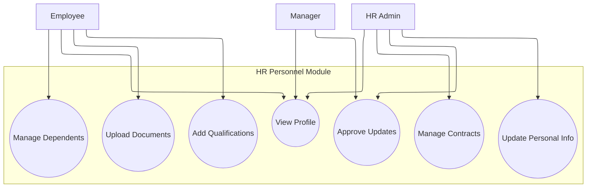
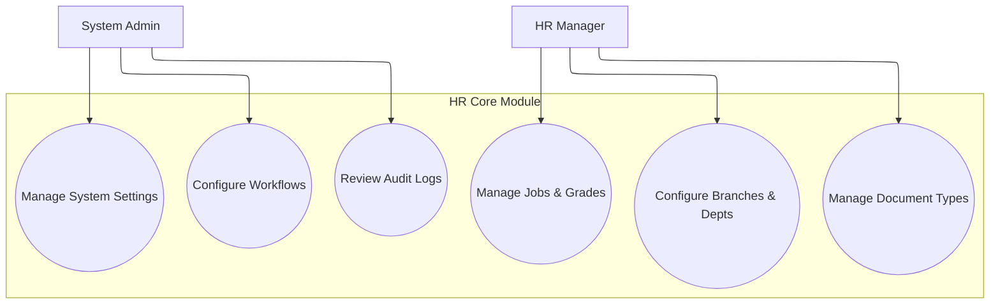
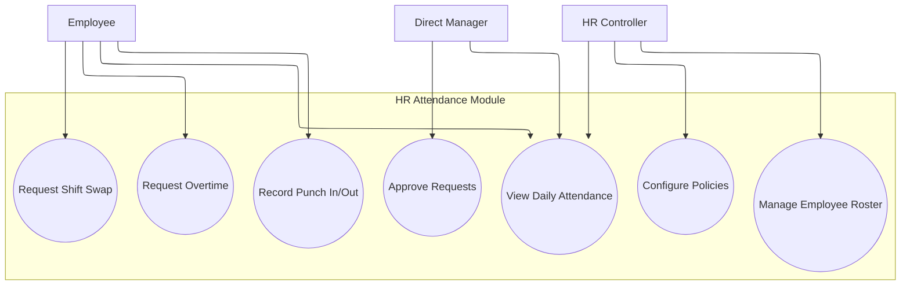

# Hospital HRMS - Use Case Diagrams (Mermaid Live Editor)

This document contains standard **Mermaid.js** syntax for the Use Case flowcharts. The text is strictly in English, using `flowchart TB` layout which natively renders perfectly in **Mermaid Live Editor** without any text-to-shape distortion.

---

## 1. HR Personnel Module

---

## 2. HR Core / Administration Module

---

## 3. HR Attendance Module

